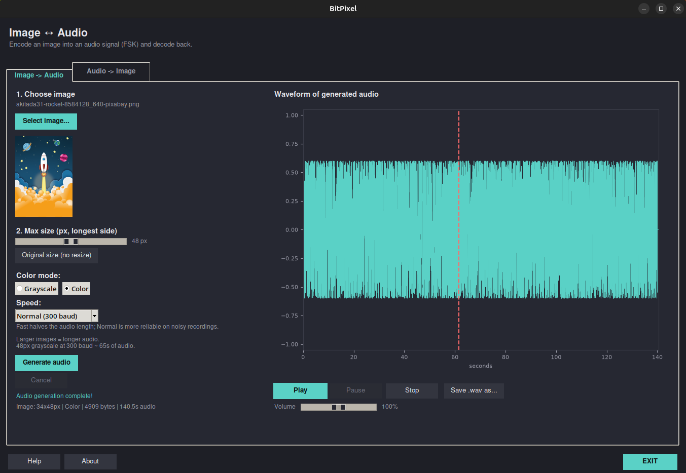

<a id="top"></a>

# BitPixel - Image ↔ Audio FSK Codec


BitPixel is a FSK (Frequency Shift Keying) based system for encoding images as audio signals and decoding them back. It supports grayscale and color images, microphone recording, direct audio playback with pause/resume/stop, and automatic output directory creation.

<p align="center">
  
  <br>
  <em>Figure 1 — Description of the figure.</em>
</p>

---

## Table of Contents

- [Features](#features)
- [Requirements](#requirements)
- [Installation](#installation)
- [Usage](#usage)
  - [Graphical Interface](#graphical-interface)
  - [Command Line](#command-line)
- [How to Use](#how-to-use)
  - [Image → Audio (Encode Tab)](#image--audio-encode-tab)
  - [Audio → Image (Decode Tab)](#audio--image-decode-tab)
  - [Playback Controls](#playback-controls)
  - [Interface](#interface)
  - [Tips](#tips)
- [Protocol](#protocol)
- [Repository Structure](#repository-structure)
- [License](#license)
- [Additional Notes](#additional-notes)

---

## Features

- **Image to Audio**: Convert any image (PNG, JPG, BMP, GIF) into an audio signal (.wav)
- **Audio to Image**: Decode a .wav file or microphone recording back into an image
- **Color/Grayscale**: Choose between grayscale and color encoding modes
- **Audio Playback Controls**: Play, Pause (resumes from the same spot), Stop, with a volume slider that works in real time
- **Waveform Position Indicator**: Red line shows current playback position; click the waveform to jump to that point
- **Status Messages**: Clear text feedback during encoding/decoding
- **Cancel Button**: Stop active conversions mid-process, including long decodes
- **Speed Selector**: Each tab (Encode and Decode) has its own independent speed setting — Normal (300 baud, most reliable) or Fast (600 baud, ~2x shorter audio). This lets you, for example, decode an old Normal-speed recording while encoding a new image at Fast, at the same time.
- **Clear Log**: Wipe the decode log before decoding a new file
- **Direct Audio Playback**: Play audio directly using sounddevice
- **Microphone Recording**: Record audio directly from your microphone
- **Auto Output Directories**: Automatically creates `output_sound/` and `output_image_recovered/`
- **Original Size Option**: Encode images at native resolution without resizing
- **CRC Verification**: Built-in checksum for data integrity

---

## Requirements

- Python 3.10+
- `pillow` — image processing
- `numpy` — numerical computation
- `matplotlib` — waveform visualization
- `sounddevice` — audio playback and microphone recording

---

## Installation

1. Create and activate a virtual environment:

```bash
python -m venv venv
source venv/bin/activate  # Linux/macOS
# venv\Scripts\Activate.ps1  # Windows
```

2. Update pip and install dependencies:

```bash
pip install --upgrade pip
pip install -r requirements.txt
```

---

## Usage

### Graphical Interface

```bash
cd src
python gui_app.py
```

### Command Line

**Encode:**

```bash
python encode.py image.jpg audio.wav 48
python encode.py image.jpg audio.wav 48 --color
```

**Decode:**

```bash
python decode.py audio.wav result.png
```

---

## How to Use

### Image → Audio (Encode Tab)

1. Click **"Select image..."** to choose an image file
2. Set the **maximum size** (or select **"Original size"** for no resize)
3. Choose **Grayscale** or **Color** mode
4. Choose the **Speed** — Normal (300 baud, most reliable) or Fast (600 baud, ~2x shorter audio)
5. Click **"Generate audio"** — a status message shows progress
6. When complete, a confirmation dialog appears
7. Use **Play / Pause / Stop** to control audio playback; Pause resumes from the same position, not from the beginning
8. Click anywhere on the waveform to seek to that point
9. Adjust **volume** with the slider — it applies immediately, even mid-playback
10. Click **"Cancel"** to stop the conversion at any time
11. Click **"Save .wav as..."** to save the audio file

### Audio → Image (Decode Tab)

1. Load a `.wav` file using **"Select .wav file..."**
2. Or click **"Record from microphone"** to capture audio live
3. Set the **Speed** to match whatever speed the audio was encoded with (Normal or Fast) — the Decode tab's Speed is independent from the Encode tab's, so this needs to be set on this tab too
4. Click **"Decode image"** — a status message shows progress
5. The recovered image appears on the right
6. Click **"Cancel"** to stop decoding
7. Click **"Save image as..."** to save the result

### Playback Controls

| Button            | Function                                 |
| ----------------- | ---------------------------------------- |
| **Play**          | Start playback, or resume after Pause    |
| **Pause**         | Stop playback without losing your place  |
| **Stop**          | Stop and reset playback to the beginning |
| **Volume slider** | Control playback volume in real time     |

The red dashed line on the waveform shows the current playback position. Click anywhere on the waveform to jump to that point.

### Interface

The interface includes:

- **Help** button: Opens a full usage tutorial with scrollable text
- **About** button: Shows application name, version, and author
- **EXIT** button: Located on the right side of the toolbar

### Tips

- **Larger images = longer audio.** At the default Normal speed (300 baud), a 48px grayscale image takes roughly 65 seconds; color takes about 3x longer for the same size (3 bytes/pixel instead of 1). Switching to Fast (600 baud) roughly halves the duration and was tested to still decode reliably, but for very noisy recordings, Normal is safer
- The Speed setting is independent per tab, if you encoded a .wav at Fast, make sure the **Decode tab's own** Speed dropdown is also set to Fast before decoding that file (it does not follow the Encode tab automatically)
- For better recordings from microphone: quiet environment, louder volume, closer devices
- If CRC verification fails on Fast, switch that tab's Speed to Normal (300 baud), it's slower but far more tolerant of noise

---

## Protocol

The encoding uses FSK modulation with the following protocol:

```
[Silence] [Preamble] [Start Marker 0x7E × 4]
[SYNC 0xAA][Data blocks up to 16 bytes][SYNC 0xAA][Data]...

Payload: [MAGIC 4B][Mode 1B][Width 2B][Height 2B][Pixels][CRC32 4B]
```

- **Modes**: 0 = Grayscale, 1 = Color (RGB)

- **Sample Rate**: 44100 Hz

- **Speed presets** (set independently per tab in the GUI; encode and decode must use the same preset for a given file):
  
  | Preset           | Baud Rate       | Bit 0 Frequency | Bit 1 Frequency |
  | ---------------- | --------------- | --------------- | --------------- |
  | Normal (default) | 300 bits/second | 1200 Hz         | 2200 Hz         |
  | Fast             | 600 bits/second | 1000 Hz         | 3000 Hz         |

---

## Repository Structure

<details>
<summary>View full repository tree</summary>

```
BitPixel/
├── src/
│   ├── gui_app.py          # Graphical interface (Tkinter)
│   ├── imgaudio_codec.py   # Core encoding/decoding engine
│   ├── encode.py           # Command-line encoder
│   └── decode.py           # Command-line decoder
├── image/                  # Sample images
├── output_sound/           # Auto-created: generated audio files
├── output_image_recovered/ # Auto-created: decoded images
│
├── requirements.txt        # Python dependencies
│
├── .editorconfig
├── .gitattributes
├── .gitignore
│
├── License
└── README.md              
```
</details>

---

## License

This project is distributed under the **GNU General Public License v3.0 (GPL-3.0)**.

**Note**: the FSK/Goertzel modulation technique used here (encoding bits as two audio frequencies, similar to Bell 202) is a standard and publicly documented method.

---

## Additional Notes

This repository is intended as practical educational material.

The test image used during development is by [akitada31 on Pixabay](https://pixabay.com/illustrations/rocket-spaceship-space-universe-8584128/), used under the [Pixabay Content License](https://pixabay.com/service/license-summary/).

---

[↑ Back to top](#top)
